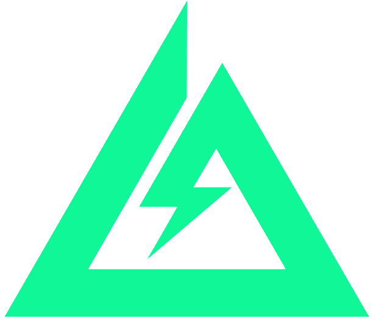

# 视觉规范文档 · Vo Manager

> **版本**：v13.2 · **2026-07-20 冻结**（用户明确定版：「就用这个吧」）
> **产品负责人**：lycheelli (PM)
> **适用范围**：DELTA FORCE **Vo Manager** · 前端开发交付标准
> **风格路线**：Speechless.ai 深色荧光青绿风

> ⚠️ **色板已冻结**：下方所有色值为项目视觉宪法。任何调整必须先获得 PM 明确确认。

---

## 1. 全局配色（v13.2 定版）

### 主色 & 底色

| 类别 | 变量名 | 色值 | 用途 |
|------|--------|------|------|
| **主色（荧光青绿）** | `--c-primary` | **`#0FF796`** | Primary 按钮、选中态、AI 悬浮球、Logo 三角、成功状态 |
| 主色深 | `--c-primary-dark` | `#0BD980` | Primary 按钮 hover |
| 主色亮 | `--c-primary-light` | `#5FFCB5` | 悬浮球 hover |
| 主色微光 | `--c-primary-glow` | `rgba(15,247,150,0.18)` | 选中态背景、光晕 |
| **主背景（深蓝黑）** | `--c-bg` | **`#192229`** | 主内容区、侧栏 |
| 更深底 | `--c-bg-0` | `#0F171C` | Modal 遮罩 |
| 表面 1 | `--c-surface` | `#1F2A32` | 卡片、输入框底、表格 hover |
| 表面 2 | `--c-surface-2` | `#26333C` | 二级卡片、内嵌区域 |
| 表面 3 | `--c-surface-3` | `#2E3B45` | 三级面板 |

### 边框 & 文字

| 类别 | 变量名 | 色值 | 用途 |
|------|--------|------|------|
| 常规边框 | `--c-border` | `#2E3B45` | 卡片/表格/输入框 |
| 强边框 | `--c-border-strong` | `#3D4C57` | focus / 强调 |
| 主文字 | `--c-text` | `#FFFFFF` | 标题、正文、表格 |
| 副文字 | `--c-text-2` | `#D4DDE3` | 二级文字 |
| 弱文字 | `--c-text-mute` | `#A1B1BC` | 说明、辅助 |
| 极弱 | `--c-text-dim` | `#6B7A85` | placeholder、禁用 |

### 状态色

| 状态 | 变量名 | 色值 | 说明 |
|------|--------|------|------|
| 待开始 | `--c-st-pending` | `#A1B1BC` | 灰 |
| 进行中 | `--c-st-progress` | `#60A5FA` | 蓝 |
| 已完成 | `--c-st-done` | `#0FF796` | 主色·荧光青绿 |
| 音画同步 | `--c-st-sync` | `#F59E0B` | 黄 |
| 危险 | `--c-danger` | `#EF4444` | 红 |

### 完整 CSS 变量声明（直接复制到前端项目）

```css
:root {
  /* 主色系 */
  --c-primary:       #0FF796;
  --c-primary-dark:  #0BD980;
  --c-primary-light: #5FFCB5;
  --c-primary-glow:  rgba(15,247,150,0.18);
  /* 深色底系 */
  --c-bg-0:      #0F171C;
  --c-bg:        #192229;
  --c-surface:   #1F2A32;
  --c-surface-2: #26333C;
  --c-surface-3: #2E3B45;
  /* 侧栏 */
  --c-sidebar:        #192229;
  --c-sidebar-hover:  rgba(255,255,255,0.04);
  --c-sidebar-active: rgba(15,247,150,0.10);
  /* 边框 */
  --c-border:        #2E3B45;
  --c-border-strong: #3D4C57;
  /* 文字 */
  --c-text:      #FFFFFF;
  --c-text-2:    #D4DDE3;
  --c-text-mute: #A1B1BC;
  --c-text-dim:  #6B7A85;
  /* 状态色 */
  --c-st-pending:  #A1B1BC;
  --c-st-progress: #60A5FA;
  --c-st-done:     #0FF796;
  --c-st-sync:     #F59E0B;
  --c-danger:      #EF4444;
  --c-warning:     #F59E0B;
  --c-info:        #60A5FA;
}
```

---

## 2. 字体

- **字体族**：`Inter, -apple-system, "PingFang SC", "Microsoft YaHei", sans-serif`
- **回退**：中文优先 PingFang SC / Microsoft YaHei

| 层级 | 字号 | 字重 | 行高 |
|------|------|------|------|
| 页面标题 (h2) | `20px` | `bold (700)` | `1.4` |
| 分区标题 (h3) | `16px` | `semibold (600)` | `1.5` |
| 正文 | `14px` | `normal (400)` | `1.5` |
| 表格数据 | `13px` | `normal (400)` | `1.5` |
| 辅助文字 | `12px` | `normal (400)` | `1.4` |
| 徽标 / 标签 | `12px` | `medium (500)` | `1.4` |
| 品牌 Logo | `24px` | `extrabold (800)` | `1.0` |

---

## 3. 组件规范

### 3.1 按钮 (Button)

- 圆角 `6px`，padding `8px 16px`，字号 `14px`，行高 `1.4`

| 变体 | 背景 | 文字 | 边框 | Hover |
|------|------|------|------|-------|
| Primary | `#4F46E5` | `#FFFFFF` | 无 | `#4338CA` |
| Outline | `#FFFFFF` | `#6B7280` | `1px solid #E5E7EB` | 边框 → `#4F46E5`，文字 → `#4F46E5` |
| Danger | `#FFFFFF` | `#EF4444` | `1px solid #FECACA` | 背景 → `#FEF2F2` |
| Small | (同上) | (同上) | (同上) | padding `4px 12px`，字号 `12px` |

```html
<button class="btn btn-primary">保存</button>
<button class="btn btn-outline">取消</button>
<button class="btn btn-danger btn-sm">删除</button>
```

### 3.2 表格 (Table)

- 边框 `1px solid #E5E7EB`
- 行高 `48px`（表头 `44px`）
- 悬停背景 `#F9FAFB`
- 表头背景 `#F9FAFB`，字号 `13px`，字重 `600`，颜色 `#6B7280`
- 单元格 padding `0 16px`，字号 `13px`

### 3.3 标签 / Tag

- 圆角 `4px`，padding `2px 8px`，字号 `12px`，字重 `500`

| 语义 | 背景 | 文字 |
|------|------|------|
| 待开始 (pending) | `#F3F4F6` | `#9CA3AF` |
| 进行中 (progress) | `#DBEAFE` | `#3B82F6` |
| 已完成 (done) | `#D1FAE5` | `#10B981` |
| 音画同步 (sync) | `#FEF3C7` | `#F59E0B` |

### 3.4 图标 (Icon)

- 风格：**线性 Line Icons**（推荐 Feather Icons / Lucide）
- 默认尺寸：`20 × 20px`
- 默认颜色：`#6B7280`（辅色）
- stroke-width：`1.8` — `2`
- 侧栏一级菜单图标：跟随文字色 `#FFFFFF`（选中态与默认态一致）
- 表格内操作图标：`16 × 16px` 或 `14 × 14px`，颜色 `#6B7280` / hover `#4F46E5`

### 3.5 表单控件

- 输入框 / Select 高度 `36px`，圆角 `6px`，边框 `1px solid #E5E7EB`
- 聚焦态：边框 → `#4F46E5`
- Placeholder 颜色：`#9CA3AF`
- 字号 `13px`

### 3.6 卡片 (Card)

- 背景 `#FFFFFF`，圆角 `8px`，边框 `1px solid #E5E7EB`
- **不使用阴影**（保持扁平清爽）
- 内边距 `16px 20px`

### 3.7 开关 (Switch)

- 宽 `38px` × 高 `22px`
- 关闭态：底 `#E5E7EB`
- 开启态：底 `#4F46E5`
- 圆钮 `18px`，`#FFFFFF`，加轻微阴影

### 3.8 复选框 (Checkbox)

- 尺寸 `14 × 14px`
- 选中色 `#4F46E5`（`accent-color`）

---

## 4. 侧边栏结构

### 4.1 布局参数

| 元素 | 规范 |
|------|------|
| 侧栏宽度 | `240px` |
| 侧栏背景 | `#1E1E2F` |
| 一级菜单 padding | `12px 16px` |
| 一级菜单字号 | `14px`，字重 `400`（选中态 `500`） |
| 一级菜单图标 | `20 × 20px`（线性） |
| 子集菜单 padding | `8px 16px 8px 32px`（padding-left `32px`） |
| 子集菜单字号 | `13px`，字重 `400`（选中态 `500`） |

### 4.2 状态

- **默认**：文字 `#FFFFFF`，背景 `transparent`
- **Hover**：背景 `rgba(255,255,255,0.08)`
- **选中 (active)**：背景 `#4F46E5`，文字 `#FFFFFF`
- **子集默认**：文字 `rgba(255,255,255,0.7)`
- **子集选中**：背景 `#4F46E5`，文字 `#FFFFFF`

### 4.3 徽标 (Badge)

- 圆角 `8px`
- 背景 `#4F46E5`，文字 `#FFFFFF`，字号 `12px`，字重 `600`
- padding `2px 8px`
- 位置：一级菜单右侧（`margin-left: auto`）
- 选中态反色：背景 `#FFFFFF`，文字 `#4F46E5`

### 4.4 层级结构

```
🗂  语音需求管理（侧栏顶部标题）
   🔍 搜索菜单

📋 需求汇总
   ├─ Yang1
   ├─ Yang2
   ├─ Yang3
   ├─ Yang4
   └─ Yang5

📝 台词管理
   ├─ AI
   ├─ SOL
   └─ MP

🎤 声优库
   ├─ 干员
   ├─ 指挥官
   └─ 路人角色

📅 录制档期        （无子集）

🎧 音频资产库  [8]（无子集 + 徽标）
```

---

## 5. Logo (DELTA FORCE · v13.2 拆分定版)

### 5.1 视觉规格（两张 PNG 并排）

从 v13.2 起，官方 Logo 已按颜色**拆分为两张独立 PNG**，以便在深色主题下让"DELTA FORCE" 文字用 CSS 反色为白色，同时保留绿三角原色。

| 元素 | 资源文件 | 尺寸 | CSS 处理 |
|------|---------|------|---------|
| 绿三角 | `./assets/DeltaForceLogo-Triangle.png` | 612×527px | **无 filter，保持原生 `#0FF796`** |
| DELTA FORCE 文字 | `./assets/DeltaForceLogo-Text.png` | 1320×128px | `filter: brightness(0) invert(1)` 反色成白 |

### 5.2 使用代码

```html
<div class="brand-logo">
  
  
</div>
```

```css
.brand-logo { display:flex; align-items:center; gap:10px; flex-shrink:0 }
.brand-logo .logo-tri { height:36px; width:auto; display:block }
.brand-logo .logo-txt { height:14px; width:auto; display:block;
                        filter: brightness(0) invert(1) }
```

### 5.3 使用红线（重要）

- ❌ **禁止替换两张 PNG**（`DeltaForceLogo-Triangle.png` 和 `DeltaForceLogo-Text.png` 均为官方原图拆分产物）
- ❌ **禁止给绿三角加 filter**（原色 `#0FF796` 恰好等于主色，不需要处理）
- ❌ **禁止改动"DELTA FORCE"字体**（字体嵌在 PNG 里，只做整体反色，不重绘）
- ❌ **禁止改动 Logo 位置**（必须在顶部品牌栏最左侧）
- ❌ **禁止对 Logo 做倾斜、拉伸、渐变、投影、彩色容器**
- ✅ 允许等比缩放（三角 32–48px，文字随三角同比例缩放）

原始未拆分文件 `assets/DeltaForceLogo.png` **仅作备份保留**，不再直接引用。

---

## 6. 顶部品牌栏 (Brand Bar · v13.2)

| 元素 | 规范 |
|------|------|
| 最小高度 | `64px` |
| 背景 | **`#192229`（深蓝黑，`--c-bg`）** |
| 底部边框 | `1px solid #2E3B45`（`--c-border`） |
| 内边距 | `10px 24px` |
| 元素间距 | `20px` |
| Logo | 见 §5·两张 PNG 并排，`gap: 10px` |
| 分隔线 | 宽 `1px`，高 `32px`，色 `#2E3B45` |
| 副标题（子系统名） | 文本 "Vo Manager"，字号 `18px`，字重 `700`，色 **`#FFFFFF`（白）** |
| 搜索框 | 高 `34px`，宽 `~400px`，圆角 `6px`，底色 `#1F2A32`，白字 |
| 图标按钮 | `34 × 34px`，圆角 `6px`，边框 `1px solid #2E3B45`，图标 `#A1B1BC` |
| 用户头像 | 圆形 `32 × 32px`，底色 **`#0FF796`（主色荧光青绿）**，**黑字加粗** |

---

## 7. 全局禁止事项（红线）

| 序号 | 禁止 | 原因 |
|------|------|------|
| 1 | ❌ 彩色渐变背景 | 与团队规范冲突 |
| 2 | ❌ 圆形头像以外的圆形装饰 | 保持视觉简洁 |
| 3 | ❌ 侧边栏 / 主内容区颜色混淆 | 必须严格分色 `#1E1E2F` vs `#F8FAFC` |
| 4 | ❌ 未确认前改动 Logo | 品牌资产受保护 |
| 5 | ❌ 图标使用面性（Filled）风格 | 全站统一线性风格 |
| 6 | ❌ 卡片使用阴影 (`box-shadow`) | 改用 `1px solid #E5E7EB` 边框 |
| 7 | ❌ 状态标签自定义配色 | 必须使用规范里的 4 种语义色 |

---

## 8. 参考实现

- **交付原型**：`./互动原型-语音需求管理系统.html`
- **CSS Design Tokens**：所有色值 / 圆角 / padding 已注入 `:root` 变量
- **验收方式**：对照本规范的第 1–7 节逐项核对，任一红线不满足即需返工

---

## 9. 版本变更记录

| 版本 | 日期 | 变更内容 |
|------|------|----------|
| v1.0 | 2026-07-17 | 初始版本：全局色板 + 字体 + 组件 + 侧栏 + Logo + 品牌栏 |

---

**文档负责人**：lycheelli (PM) · 有疑问请在群内 @她

